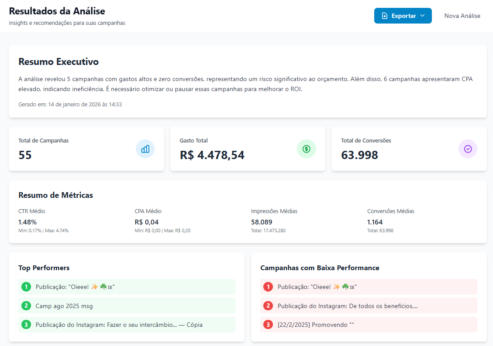
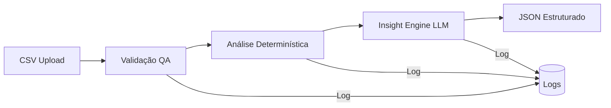

# AI Campaign Analyst 🚀

> Serviço de IA que analisa dados de campanhas de marketing digital e gera insights acionáveis.



[](https://www.python.org/downloads/)
[](https://fastapi.tiangolo.com/)
[](https://langchain.com/)
[](https://vuejs.org/)
[](https://vitejs.dev/)

## 📋 Problema

Times de marketing:
- Recebem muitos relatórios de diferentes canais
- Perdem tempo interpretando métricas brutas
- Têm dificuldade em transformar números em ações práticas

**Este sistema transforma:** `Dados brutos → Diagnóstico → Recomendações acionáveis`

## 🏗️ Arquitetura



### Fluxo de Dados

1. **Upload CSV** → `csv_loader.py` lê e parseia
2. **Validação** → `validator.py` verifica estrutura, valores nulos, outliers
3. **Análise Métricas** → `metrics_analyzer.py` calcula estatísticas e detecta padrões
4. **Insight Engine** → `insight_chain.py` gera insights via LLM (ou fallback)
5. **API Response** → JSON estruturado com insights e recomendações

## 🛠️ Stack Tecnológica

### Backend

| Tecnologia | Uso |
|------------|-----|
| **FastAPI** | API REST moderna, async, Swagger automático |
| **Pydantic v2** | Validação type-safe, serialização JSON |
| **Pandas** | Análise de dados determinística |
| **LangChain** | Orquestração de LLMs |
| **structlog** | Logging estruturado JSON |
| **pytest** | Testes unitários e integração |

### Frontend

| Tecnologia | Uso |
|------------|-----|
| **Vue 3** | Framework JavaScript progressivo |
| **Vite** | Build tool rápido e moderno |
| **Pinia** | Gerenciamento de estado |
| **Vue Router** | Roteamento SPA |
| **Axios** | Cliente HTTP para comunicação com API |
| **Chart.js** | Gráficos interativos e visualizações |
| **Tailwind CSS** | Framework CSS utilitário |
| **jsPDF** | Geração de PDFs para exportação |
| **xlsx** | Geração de arquivos Excel |

### LLMs Suportados

- **OpenAI** (GPT-4o-mini)
- **Anthropic** (Claude 3.5 Sonnet)
- **Google** (Gemini 2.0 Flash)
- **Mock** (fallback determinístico para dev/testes)

## 🚀 Quick Start

### Backend (API)

#### 1. Clone e instale dependências

```bash
git clone <repo-url>
cd cogna
pip install -r requirements.txt
```

#### 2. Configure variáveis de ambiente

```bash
cp .env.example .env
# Edite .env com suas API keys (opcional)
```

#### 3. Execute a API

```bash
uvicorn app.main:app --reload
```

#### 4. Acesse a documentação

- Swagger UI: http://localhost:8000/docs

### Frontend (Interface Web)

#### 1. Instale as dependências

```bash
cd frontend
npm install
```

#### 2. Configure a URL da API

Crie um arquivo `.env` na pasta `frontend`:

```env
VITE_API_BASE_URL=http://localhost:8000
```

#### 3. Execute o frontend

```bash
npm run dev
```

A aplicação estará disponível em `http://localhost:5173` (ou porta indicada pelo Vite)

#### 4. Build para produção

```bash
npm run build
```

## 📊 Uso

### Via Interface Web (Recomendado)

1. Acesse o frontend em `http://localhost:5173`
2. Faça upload de um arquivo CSV usando drag & drop ou seleção de arquivo
3. Aguarde a análise (pode levar alguns segundos)
4. Visualize os insights, gráficos e recomendações
5. Exporte os resultados em PDF, Excel ou JSON

### Via API (cURL)

#### Endpoint: POST /analyze-campaign

Envie um arquivo CSV com suas campanhas:

```bash
curl -X POST "http://localhost:8000/analyze-campaign" \
  -H "Content-Type: multipart/form-data" \
  -F "file=@data/sample_campaign.csv"
```

### Formato do CSV

| Coluna | Tipo | Descrição |
|--------|------|-----------|
| `campaign_name` | string | Nome da campanha |
| `impressions` | int | Número de impressões |
| `clicks` | int | Número de cliques |
| `ctr` | float | Click-through rate (%) |
| `conversions` | int | Número de conversões |
| `cost` | float | Custo total |
| `cpa` | float | Custo por aquisição |
| `channel` | string | Canal (Google Ads, Meta, etc.) |

### Resposta

```json
{
  "executive_summary": "Análise de 25 campanhas com gasto total de $X...",
  "key_issues": [
    {
      "title": "High CPA",
      "description": "...",
      "severity": "high",
      "affected_campaigns": ["Campaign A", "Campaign B"]
    }
  ],
  "recommendations": [
    {
      "title": "Otimizar campanhas com CPA alto",
      "description": "...",
      "priority": "high",
      "expected_outcome": "Redução de 20-30% no CPA"
    }
  ],
  "risk_alerts": [...],
  "metrics_summary": {...}
}
```

## 🧪 Testes

```bash
# Executar todos os testes
pytest tests/ -v

# Com cobertura
pytest tests/ -v --cov=app --cov-report=term-missing

# Testes específicos
pytest tests/test_validator.py -v
pytest tests/test_metrics_analyzer.py -v
pytest tests/test_insight_chain.py -v
pytest tests/test_routes.py -v
```

## 💎 Diferenciais

### QA Mindset Aplicado à IA

- ✅ **Validação antes da IA**: Erros claros antes de processar
- ✅ **Testes de regressão de prompt**: Garante consistência do output
- ✅ **Fallback determinístico**: Sistema funciona mesmo se LLM falhar

### IA como Copiloto

- IA só interpreta dados **já analisados**
- Análise determinística reduz alucinação
- Métricas calculadas com Pandas, insights com LLM

### Clareza de Impacto

- Cada insight gera uma **ação clara**
- Problemas priorizados por severidade
- Recomendações com **resultado esperado**

## 📁 Estrutura do Projeto

```
cogna/
├── app/                       # Backend (FastAPI)
│   ├── main.py                # FastAPI app
│   ├── config.py              # Configurações
│   ├── logging_config.py      # Logging estruturado
│   ├── routes/
│   │   ├── health.py          # GET /health
│   │   └── analyze.py         # POST /analyze-campaign
│   ├── services/
│   │   ├── csv_loader.py      # Carrega CSV
│   │   ├── validator.py       # Validação QA
│   │   ├── metrics_analyzer.py # Análise determinística
│   │   └── insight_chain.py   # LangChain + LLMs
│   ├── schemas/
│   │   └── campaign.py        # Pydantic models
│   └── prompts/
│       └── insight_prompt.txt # Template do prompt
├── frontend/                  # Frontend (Vue.js)
│   ├── src/
│   │   ├── components/        # Componentes Vue
│   │   │   ├── Charts/        # Gráficos (Chart.js)
│   │   │   ├── CampaignUpload.vue
│   │   │   ├── ExecutiveSummary.vue
│   │   │   ├── KeyIssues.vue
│   │   │   ├── Recommendations.vue
│   │   │   └── ...
│   │   ├── services/          # API e exportação
│   │   ├── stores/            # Pinia stores
│   │   ├── utils/             # Utilitários
│   │   └── views/             # Páginas
│   ├── package.json
│   └── vite.config.js
├── tests/                     # Testes do backend
│   ├── conftest.py
│   ├── test_validator.py
│   ├── test_metrics_analyzer.py
│   ├── test_insight_chain.py
│   └── test_routes.py
├── data/                      # Dados de exemplo
│   └── sample_campaign.csv
├── requirements.txt           # Dependências Python
└── README.md                  # Este arquivo
```

## 🎨 Frontend

O frontend oferece uma interface web completa e moderna para interagir com a API de análise de campanhas.

Para mais detalhes sobre o frontend, consulte o [README do frontend](frontend/README.md).

## ⚠️ Limitações (Fora de Escopo)

- ❌ Integrações reais com Google Ads / Meta Ads
- ❌ Persistência em banco de dados
- ❌ Autenticação / Autorização
- ❌ Cache de resultados
- ❌ Rate limiting

## 🔧 Configuração

### Variáveis de Ambiente

| Variável | Descrição | Default |
|----------|-----------|---------|
| `LLM_PROVIDER` | Provider: openai, claude, gemini, mock | `mock` |
| `OPENAI_API_KEY` | Chave da API OpenAI | - |
| `ANTHROPIC_API_KEY` | Chave da API Anthropic | - |
| `GOOGLE_API_KEY` | Chave da API Google | - |
| `LOG_LEVEL` | Nível de log | `INFO` |
| `LOG_FORMAT` | Formato: json, console | `console` |

## 📝 Decisões Técnicas

1. **FastAPI**: Escolhido por performance async, validação integrada e Swagger automático
2. **Pydantic v2**: Schemas type-safe garantem contratos claros entre camadas
3. **Análise pré-LLM**: Reduz custo de tokens e alucinação ao enviar dados já processados
4. **Fallback determinístico**: Garante disponibilidade mesmo com falha do LLM
5. **structlog**: Logs em JSON facilitam integração com observabilidade

## 📄 Licença

MIT
